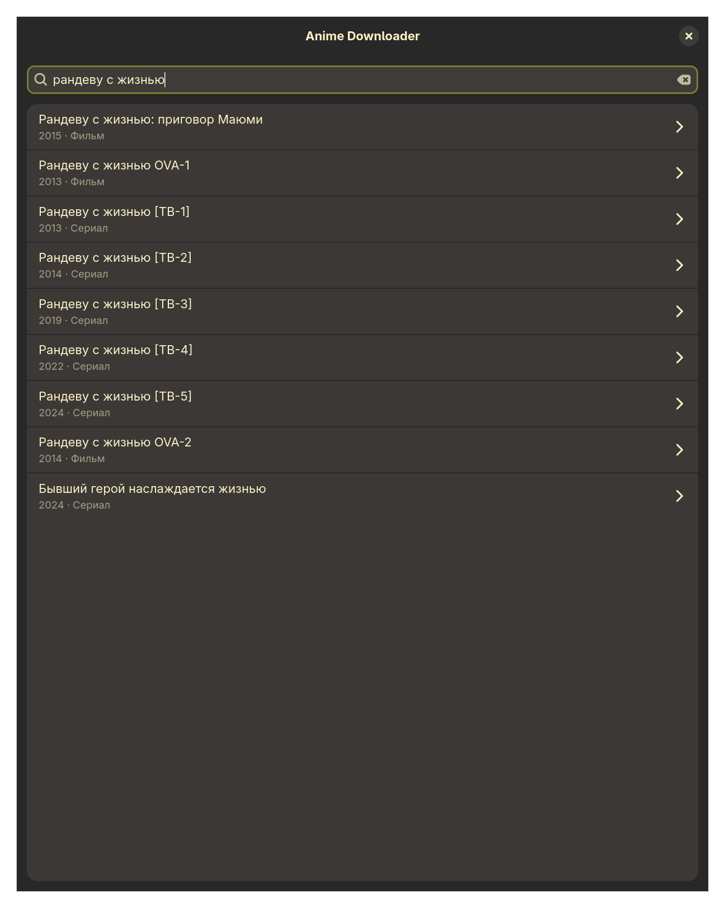
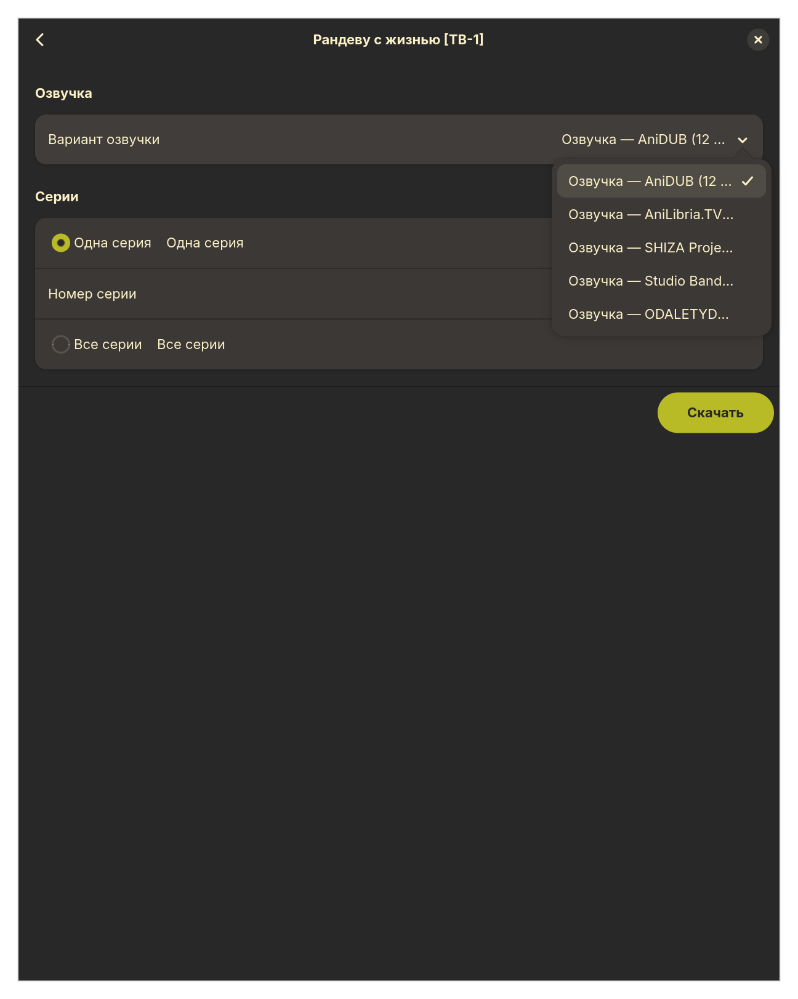
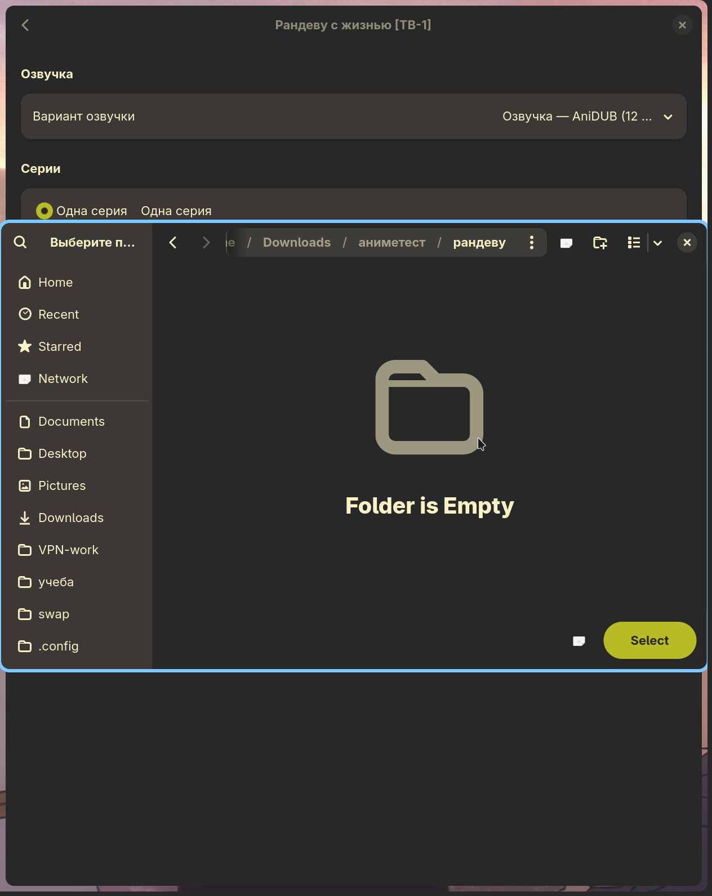
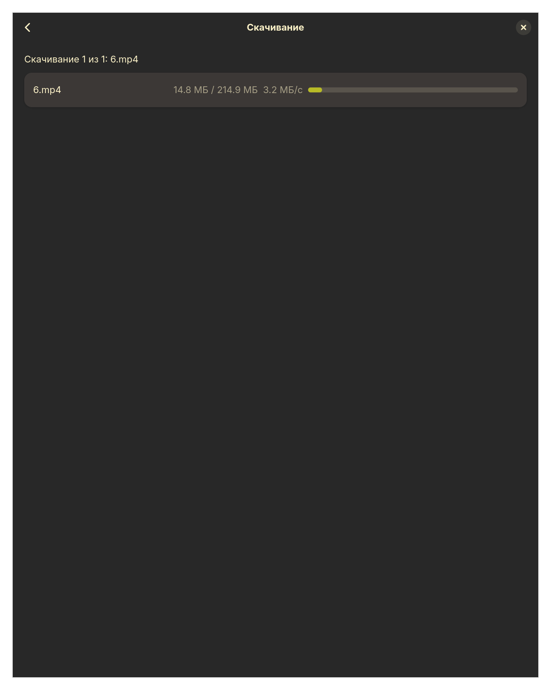
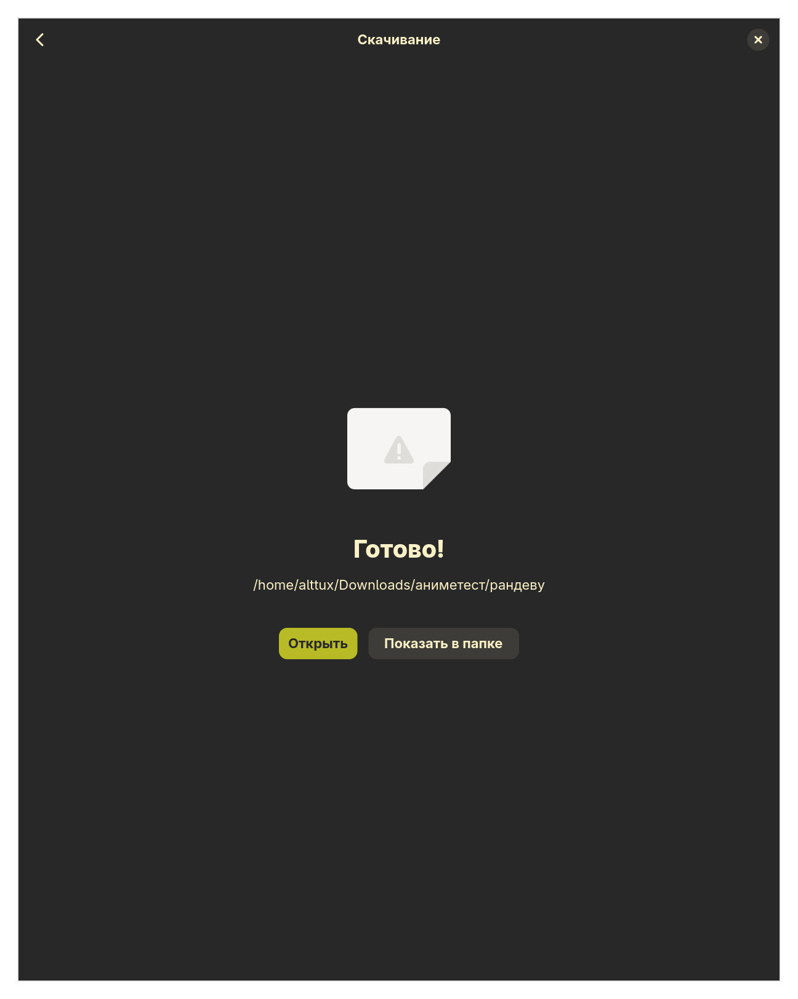

<div align="center">

# 🎬 anime-dlp

**CLI-утилита для скачивания аниме с плеера Kodik**

[](LICENSE.txt)
[](pyproject.toml)
[](https://github.com/Textualize/rich)

Простой и удобный терминальный интерфейс для поиска, выбора озвучки и скачивания
аниме-сериалов и фильмов с плеера Kodik.

</div>

---

## 📖 Оглавление

- [Возможности](#-возможности)
- [Установка](#-установка)
  - [Flatpak](#flatpak)
  - [Из исходников](#из-исходников)
  - [Windows и macOS](#windows-и-macos)
  - [Сборка пакета](#сборка-пакета)
- [Использование](#-использование)
  - [Пример работы](#пример-работы)
  - [Аргументы командной строки](#аргументы-командной-строки)
- [Архитектура проекта](#-архитектура-проекта)
- [Стек технологий](#-стек-технологий)
- [Лицензия](#-лицензия)

---

## ✨ Возможности

- 🔎 **Поиск аниме** по названию (поддержка кириллицы) через [anime-parsers-ru](https://github.com/YaNesyTortiK/AnimeParsers)
- 🎙️ **Выбор озвучки** — программа показывает все доступные варианты озвучки/субтитров
- 📺 **Скачивание серии, всего сезона или фильма** одной командой
- ⚡ **Многопоточная загрузка** с докачкой по диапазонам (Range-запросы) для максимальной скорости
- 📊 **Красивый прогресс-бар** с скоростью загрузки и оставшимся временем ([rich](https://github.com/Textualize/rich))
- 🗂️ **Указание директории загрузки** через флаг `-d`
- 📝 **Логирование вывода** всей сессии в файл `anime-dlp.log` через флаг `--logging`

---

## 🚀 Установка

### Flatpak

Самый простой способ — Flatpak: Python, GTK4, libadwaita и **ffmpeg** уже
входят в пакет, ставить их отдельно не нужно.

**Установка готового пакета** (если вам передали файл `anime-dlp.flatpak`):

```bash
flatpak install --user anime-dlp.flatpak
```

Запуск — через меню приложений или командой:

```bash
flatpak run io.github.alttux.AnimeDlp                       # графический интерфейс
flatpak run --command=anime-dlp io.github.alttux.AnimeDlp   # интерфейс командной строки
```

**Сборка Flatpak из исходников.** Понадобятся `flatpak` и `flatpak-builder`,
а также рантайм и SDK GNOME:

```bash
flatpak remote-add --if-not-exists --user flathub https://dl.flathub.org/repo/flathub.flatpakrepo
flatpak install --user flathub org.gnome.Platform//49 org.gnome.Sdk//49
```

Сборка и установка:

```bash
cd flatpak
flatpak-builder --force-clean --user --install --repo=repo build-dir io.github.alttux.AnimeDlp.yml
```

Чтобы получить один файл `.flatpak` и передать его другому человеку:

```bash
flatpak build-bundle repo ../anime-dlp.flatpak io.github.alttux.AnimeDlp
```

Все шаги выше объединены в `flatpak/build.sh` — скрипт сам проверит remote и
рантайм, соберёт пакет и положит готовый `anime-dlp.flatpak` в корень проекта:

```bash
./flatpak/build.sh
```

> Зависимости Python зафиксированы (с хешами) в `flatpak/python3-deps.json`,
> потому что во время сборки Flatpak нет доступа в сеть. Если вы поменяли
> `requirements.txt`, пересоздайте этот файл:
> ```bash
> cd flatpak
> curl -sSLO https://raw.githubusercontent.com/flatpak/flatpak-builder-tools/master/pip/flatpak-pip-generator.py
> pip install "requirements-parser>=0.11.0,<1.0.0" "packaging>=23.0"
> python flatpak-pip-generator.py --runtime='org.gnome.Sdk//49' \
>     --requirements-file=../requirements.txt --output python3-deps
> ```
> Флаг `--runtime` заставляет резолвить пакеты внутри SDK, чтобы версии
> совпадали с Python в рантайме.

В Flatpak файлы по умолчанию скачиваются в `~/Downloads`, а токен Kodik
хранится в `~/.var/app/io.github.alttux.AnimeDlp/data/`.

### Из исходников

Требования: **Python 3.10+**

```bash
git clone https://github.com/alttux/anime-dlp.git
cd anime-dlp

python3 -m venv .venv
source .venv/bin/activate      # для Windows: .venv\Scripts\activate

pip install -r requirements.txt
pip install .
```

После установки в окружении станет доступна команда `anime-dlp`.

Чтобы использовать графический интерфейс (флаг `--gui`), установите
дополнительную зависимость `PyGObject`, а также системные пакеты **GTK4** и
**libadwaita** (в Arch/CachyOS: `gtk4`, `libadwaita`, `python-gobject`):

```bash
pip install -r requirements.txt
pip install ".[gui]"
```

### Windows и macOS

Flatpak — только для Linux, но CLI и GUI работают и на Windows, и на macOS.

**Windows**: готовый **CLI `.exe`** (без GUI, ничего дополнительно
устанавливать не нужно) собирается автоматически в CI на каждый релизный
тег — скачать можно во вкладке [Releases][releases], либо для последнего
коммита в `main` — во вкладке [Actions][actions-win] → workflow
"Windows build" → артефакты сборки. Файл автономный (собран PyInstaller'ом),
Python ставить не нужно:

```powershell
.\anime-dlp-windows-x86_64-<версия>.exe -d "$HOME\Videos\Anime"
```

> 🪟 Для GUI на Windows готовой сборки в CI нет (GTK4/libadwaita без готовых
> pip-колёс) — собирается из исходников через MSYS2, см. отдельную
> **подробную пошаговую инструкцию** — **[WINDOWS.md](WINDOWS.md)**.

**macOS**: готовый **`.dmg`-установщик** с GUI (GTK4 + libadwaita, ffmpeg
внутрь не входит) собирается автоматически в CI на каждый релизный тег —
скачать можно во вкладке [Releases][releases], либо для последнего коммита
в `main` — во вкладке [Actions][actions-macos] → workflow "macOS build" →
артефакты сборки. Откройте `.dmg` и перетащите `AnimeDlp.app` в
`Applications`.

[releases]: https://github.com/alttux/anime-dlp/releases
[actions-win]: https://github.com/alttux/anime-dlp/actions/workflows/windows-build.yml
[actions-macos]: https://github.com/alttux/anime-dlp/actions/workflows/macos-build.yml

> Для серий, которые Kodik отдаёт только через HLS, нужен **ffmpeg** в
> `PATH`: на Windows — `winget install ffmpeg` или скачать с
> [ffmpeg.org](https://ffmpeg.org/download.html), на macOS —
> `brew install ffmpeg`. Без него скачаются только серии с обычной
> Range-раздачей.
>
> Токен Kodik и папка загрузок по умолчанию (если не указан `-d`) для
> Windows-exe — `%APPDATA%\anime-dlp` и `~\Downloads`, для macOS-приложения —
> `~/Library/Application Support/anime-dlp` и `~/Downloads`.
>
> Флаг `-i/--interface` (привязка к сетевому интерфейсу) работает только в
> Linux — на Windows/macOS программа сообщит об этом и завершится с
> ошибкой, если флаг передан; остальной функционал не затронут.

Собрать `.dmg` для macOS самостоятельно из исходников можно скриптами в
`packaging/macos/` (`make_icns.sh` + `build.sh`) — именно они используются в
CI, см. `.github/workflows/macos-build.yml`.

**Графический интерфейс (GUI)** собирается из исходников, так как готовых
pip-колёс GTK4/libadwaita для Windows и macOS нет — их ставят через
системный пакетный менеджер платформы.

<details>
<summary><b>GUI на Windows — через MSYS2</b></summary>

1. Установите [MSYS2](https://www.msys2.org/) и откройте терминал
   **MSYS2 MinGW64** (не обычный `MSYS2 MSYS`).
2. Поставьте GTK4, libadwaita и Python-биндинги:
   ```bash
   pacman -Syu   # при необходимости перезапустить терминал и повторить
   pacman -S mingw-w64-x86_64-python mingw-w64-x86_64-python-pip \
             mingw-w64-x86_64-python-gobject mingw-w64-x86_64-gtk4 \
             mingw-w64-x86_64-libadwaita mingw-w64-x86_64-ffmpeg
   ```
3. Установите anime-dlp в этот же MSYS2-Python (из исходников или, после
   публикации на PyPI, `pip install anime-dlp[gui]`):
   ```bash
   git clone https://github.com/alttux/anime-dlp.git
   cd anime-dlp
   python -m pip install --no-build-isolation ".[gui]"
   ```
4. Запуск (из того же терминала MSYS2 MinGW64):
   ```bash
   anime-dlp --gui
   ```

Подробности и решение проблем — в [WINDOWS.md](WINDOWS.md).
</details>

<details>
<summary><b>GUI на macOS — через Homebrew</b></summary>

1. Поставьте [Homebrew](https://brew.sh/), затем GTK4/libadwaita/PyGObject
   и ffmpeg:
   ```bash
   brew install gtk4 libadwaita pygobject3 adwaita-icon-theme \
                gobject-introspection ffmpeg
   ```
2. Создайте виртуальное окружение с доступом к системным пакетам Homebrew
   (иначе Python не увидит PyGObject, поставленный через brew) и установите
   anime-dlp в него:
   ```bash
   git clone https://github.com/alttux/anime-dlp.git
   cd anime-dlp
   "$(brew --prefix python3)/bin/python3" -m venv --system-site-packages .venv
   source .venv/bin/activate
   pip install .
   ```
3. Запуск (в активированном `.venv`):
   ```bash
   anime-dlp --gui
   ```

Готовый `.dmg` (без сборки из исходников) можно скачать во вкладке
[Releases][releases] — см. выше.
</details>

### Сборка пакета

Проект собирается стандартными средствами Python (`setuptools`):

```bash
python3 -m pip install --upgrade build
python3 -m build
```

Готовые `.whl` и `.tar.gz` появятся в директории `dist/`. Установить собранный пакет можно так:

```bash
pip install dist/anime_dlp-*.whl
```

Либо через `./build.sh` — он делает то же самое, но перед сборкой
автоматически увеличивает patch-версию в `pyproject.toml` на 1 (см.
`scripts/bump_version.py`), чтобы у каждой новой сборки была своя версия.
Тот же скрипт версии дергает и `flatpak/build.sh`, так что версия одна общая
для wheel/sdist и для Flatpak-пакета.

---

## 🕹 Использование

Запустите программу командой:

```bash
anime-dlp
```

По умолчанию файлы скачиваются в директорию самой программы. Чтобы указать
свою директорию для загрузки, используйте флаг `-d`:

```bash
anime-dlp -d ~/Videos/Anime
```

Далее программа проведёт вас через интерактивный диалог: поиск аниме → выбор
варианта из списка → выбор озвучки → выбор серии (или всего сезона).

### Графический интерфейс

Вместо консольного диалога можно запустить GUI на GTK4 + libadwaita:

```bash
anime-dlp --gui
```

Окно позволяет ввести название аниме (варианты подгружаются по мере ввода),
выбрать нужный тайтл из списка, затем на открывшемся экране — озвучку и
серию (или все серии сразу). Кнопка **«Скачать»** в правом нижнем углу
открывает системный диалог выбора папки, после чего скачивание идёт с
прогресс-барами по каждому файлу — аналогично консольной версии.

<p align="center">
  
  
</p>
<p align="center">
  
  
</p>
<p align="center">
  
</p>

### Аргументы командной строки

| Флаг              | Описание                                                            |
|-------------------|----------------------------------------------------------------------|
| `-d`, `--dir`     | Директория для скачивания аниме (по умолчанию — директория программы) |
| `--logging`       | Сохранять весь вывод консоли в файл `anime-dlp.log` внутри директории загрузки |
| `--gui`           | Запустить графический интерфейс (GTK4 + libadwaita) вместо консольного диалога |
| `-i`, `--interface` | Сетевой интерфейс для выхода в интернет, в обход VPN/TUN (только Linux) |
| `-h`, `--help`    | Показать справку по аргументам                                     |

### Пример работы

```bash
$ anime-dlp -d ~/Videos/Anime

Введите название аниме: Рандеву с жизнью
Поиск...

Найдено аниме:
  1. Рандеву с жизнью: приговор Маюми (2015) [shikimori: 24655]
  2. Рандеву с жизнью OVA-1 (2013) [shikimori: 17641]
  3. Рандеву с жизнью [ТВ-1] (2013) [shikimori: 15583]
  4. Рандеву с жизнью [ТВ-2] (2014) [shikimori: 19163]
  5. Рандеву с жизнью [ТВ-3] (2019) [shikimori: 36633]

Выберите номер аниме: 3

Получение информации об озвучках...

Доступные озвучки (всего серий: 12):
  1. [Озвучка] AniDUB (12 эп.)
  2. [Озвучка] AniLibria.TV (12 эп.)
  3. [Озвучка] SHIZA Project (12 эп.)
  4. [Озвучка] Studio Band (12 эп.)
  5. [Озвучка] ODALETYDUB (3 эп.)

Выберите номер озвучки: 2

Доступны серии с 1 по 12
Введите номер серии (или 'all' для скачивания всех): all

# далее программа показывает прогресс скачивания в виде прогресс-бара
```

Если выбранный тайтл — фильм, шаг с выбором серии пропускается автоматически.

Чтобы сохранить весь вывод сессии в лог-файл (например, для запуска на
домашнем сервере без интерактивного терминала под рукой):

```bash
anime-dlp -d ~/Videos/Anime --logging
# лог появится в ~/Videos/Anime/anime-dlp.log
```

---

## 🏗 Архитектура проекта

```
anime-dlp/
├── src/anime_dlp/
│   ├── main.py                # Точка входа, разбор аргументов CLI
│   ├── config.py               # Конфигурационные параметры (пути, заголовки, число потоков)
│   ├── logger.py               # Логирование вывода консоли в файл (--logging)
│   ├── labels.py                # Общие текстовые метки (типы тайтлов)
│   ├── filenames.py             # Общая логика формирования имён файлов
│   ├── cli/                    # Интерфейс командной строки
│   │   ├── app.py              # Основной сценарий взаимодействия с пользователем
│   │   ├── prompts.py          # Запросы ввода у пользователя
│   │   └── display.py          # Оформление вывода (таблицы, баннеры, сообщения)
│   ├── gui/                     # Графический интерфейс (GTK4 + libadwaita, --gui)
│   │   ├── app.py               # Точка входа GUI, Adw.Application
│   │   ├── window.py            # Главное окно и навигация между экранами
│   │   ├── search_page.py       # Поиск аниме с живыми подсказками
│   │   ├── details_page.py      # Выбор озвучки и серий, кнопка «Скачать»
│   │   ├── download_page.py     # Экран скачивания с прогресс-барами
│   │   └── formatting.py        # Форматирование размера/скорости для GUI
│   └── core/                   # Основная бизнес-логика
│       ├── anime_service.py    # Поиск аниме и получение ссылок на скачивание
│       ├── downloader.py       # Многопоточное скачивание с колбэком прогресса
│       └── token_manager.py    # Хранение и получение Kodik-токена
├── pyproject.toml              # Метаданные и зависимости пакета
├── requirements.txt            # Зафиксированные версии зависимостей
└── LICENSE.txt                 # Лицензия MIT
```

Проект скачивает видео с плеера **Kodik**, используя библиотеку
[anime-parsers-ru](https://github.com/YaNesyTortiK/AnimeParsers) для поиска и
получения прямых ссылок, после чего запускает многопоточную загрузку с
докачкой по диапазонам байт (если сервер их поддерживает).

---

## 🛠 Стек технологий

- [anime_parsers_ru](https://pypi.org/project/anime-parsers-ru/) — поиск и получение ссылок на видео с Kodik
- [rich](https://github.com/Textualize/rich) — оформление терминального интерфейса, таблицы и прогресс-бары
- [requests](https://docs.python-requests.org/) — HTTP-запросы и скачивание файлов
- [beautifulsoup4](https://www.crummy.com/software/BeautifulSoup/) — парсинг HTML
- [PyGObject](https://pygobject.gnome.org/) + **GTK4** / **libadwaita** — графический интерфейс (опционально, `--gui`)

---

## 📄 Лицензия

Проект распространяется под лицензией [MIT](LICENSE.txt).
